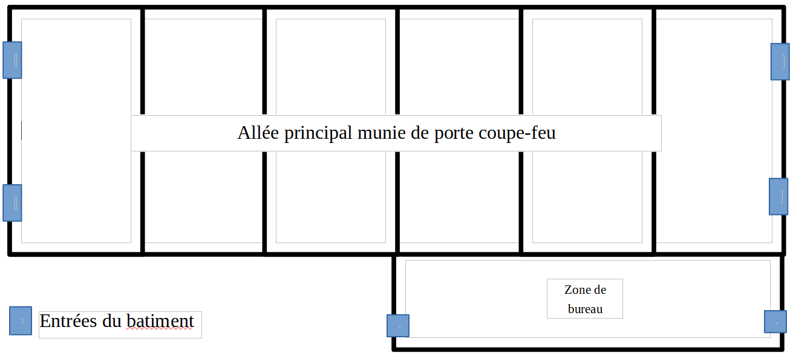

# Contexte - Société ALL4SPORT

Cette section décrit les activités de la société ALL4SPORT et son organisation interne.

## Présentation de la société ALL4SPORT

ALL4SPORT a été créé en 2008 à partir d’une idée toute simple : répondre aux besoins des sportifs amateurs et passionnés en leur proposant une gamme d'articles de sports adaptés à chacun d’eux.

ALL4SPORT est une société anonyme au capital de 150 K€, elle réalise un chiffre d’affaire annuel de 1,2 M€ et compte plus de 200 collaborateurs. Son siège social est basé à Lille, carrefour de l'Europe, grande ville étudiante et dynamique.

ALL4SPORT s'est organisée autour de deux activités principales :

- la logistique : stockage et transport
- la vente : magasins et service en ligne

ALL4SPORT gère de façon distincte ses deux activités et fonctionne donc en interne sur un mode de travail client/fournisseur. Chaque activité étant tour à tour client puis fournisseur selon les besoins de l’entreprise.

### Identification produit

ALL4SPORT a mis au point une identification des produits et enregistre l'ensemble des informations suivantes pour chaque produit :

- référence produit : code qui inclut les trois premières lettres du fournisseur, les trois premières lettres du rayon (sport) et un nombre auto-incrémenté de douze chiffres ;
- nom du fournisseur ;
- rayon du produit ;
- coût unitaire HT ;
- description du produit ;
- photos du produit : de 1 à 5 photo(s) par produit ;
- quantité en stock Internet ;
- quantité en stock pour chaque magasin ;
- lieu de stockage.

### Suivi client

ALL4SPORT souhaite être proche de ses clients. La société se base sur un fichier client précis et exhaustif. Ainsi pour chaque client est enregistré :

- code client : code constitué des trois lettres "CLI" suivies d'un nombre auto-incrémenté de huit chiffres ;
- nom et prénom ;
- adresse complète ;
- email ;
- téléphone ;
- date de naissance ;
- nombre d'enfants ;
- âge des enfants ;
- liste des sports pratiqués ;
- historique des achats ;
- date du dernier achat.

### Workflow de vente en ligne

#### Workflow de vente en magasin

(Préciser le compte client avec choix d'un magasin par défaut)

### Livraison

La société ALL4SPORT propose deux modes de livraison à ses clients Internet :

- retrait en magasin : gratuit ;
- livraison à domicile : forfait de 10 € par commande.

### Zone d'expédition

Chaque entrepôt a une zone d'expédition. Ces zones sont déterminées par les facilités de transport. Ainsi chaque magasin dépend d'un entrepôt.

## Implantation nationale et structurelle

### Carte de France des locaux (entrepôts et magasins) de ALL4SPORT

### Implantation des entrepôts (points jaunes sur la carte)

Les entrepôts sont au nombre de trois, basés stratégiquement au Havre, à Marseille et à Lyon.

Les entrepôts sont construits selon une architecture identique, dite « en module ». Chaque bâtiment est ainsi divisé en plusieurs modules séparés par des parois coupe-feu. Chaque module reçoit une installation de rayonnage industriel organisée en rangées, chaque rangée étant divisée en sections, chaque section étant divisée en étagères. La hauteur maximum est de huit mètres et la capacité de charge s'élève à trois tonnes par section.

#### Exemple de rayonnage industriel

#### Exemple de plan d'un bâtiment divisé en six modules

Les *modules* seront ici identifiés de *M1 à M6*. Chaque module dispose de *six rangées de chaque côté* de l'allée principale, identifiés de *A à F* à droite et de *G à L* à gauche. Chaque rangée est elle-même divisée en *sections* (zone entre deux montants) numérotées de *1 à 12*. Enfin chaque section est divisée en *étagères* numérotées de *1 à 8* (8 est un maximum ; toutes les sections ne disposent pas du même nombre d’étagères). Une étagère spécifique du bâtiment est appelée *cellule de stockage*.

Exemple d'identification d'une cellule de stockage : *M2D3.5* (Module 2, Rangée D, Section 3, étagère 5).

Les cellules sont étiquetées au moyen de code à barres pour faciliter la lecture et l'enregistrement lors du rangement.

#### Exemple de plan d'une zone logistique

Chaque entrepôt est en réalité une zone logistique qui dispose de cinq bâtiments. Ces zones sont installées idéalement proche des voies de communication : autoroutes, voies ferrées, aéroports, ports maritimes.

### Implantation des magasins (points rouges sur la carte)

Les magasins sont au nombre de douze, installés dans les villes de Lille, Arras, Amiens, Paris, Reims, Metz, Rennes, Tour, Lyon, Bordeaux, Toulouse et Nice.

La zone magasin dispose de rayons organisés selon les différentes disciplines de sport. La zone de stock permet de fournir le magasin en produit, normalement pour cinq jours d'ouverture. La zone de bureau comprend des bureaux, le local technique informatique et le coffre sécurisé.
